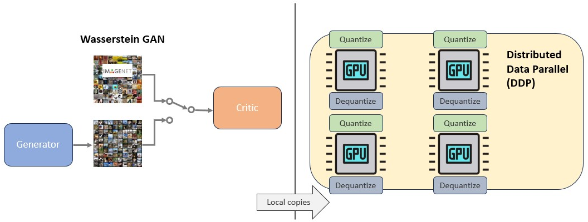

# High Performance Computing

In this repository some projects in the context of High Performance Computing are presented. These projects include contents of the graduate level courses of the technical university of munich and école polytechnique paris. 

## Efficient Unbiased Training of Large-scale Distributed WGAN
:key: Keywords: Distributed Data Parallel, Wasserstein GAN (WGAN)

:wrench: C++, CUDA, PyTorch (Cuda Backend), Open MPI, NCLL

:round_pushpin: 

This project considers a multi-GPU settings
where multiple processors/workers/clients have access to local stochastic dual
vectors. This setting includes a broad range of important problems from distributed
convex minimization to min-max and games. Using quantized generalized extra-gradient (Q-GenX) the given monotone variational inequality problem (WGAN) can be solved. This work contributed to [Distributed Extra-Gradient with Optimal Complexity and Communication Guarantees, ICLR23](https://infoscience.epfl.ch/record/300852).

## Barnsleys Fern
:key: Keywords: Barnsley's Fern

:wrench: OpenMP, Eigen

:round_pushpin: 

Barnsley's fern uses four affine transformations to create the shown fern.

:link: https://en.wikipedia.org/wiki/Barnsley_fern

## Asynchronous Value Iteration (AVI)

:key: Keywords: Asynchronous Value Iteration

:wrench: CFFI, OpenMP, MPI, Eigen 

:round_pushpin: 

The core of the project is a stochastic navigation task. The agent jumps between stars consuming fuel affecting the jump range. Certain stars allow refueling. A specific target star has to be reached in an optimal way.

State $x \in \mathcal{X} = \{1, \dots, K\},$ with $K > 0$ and subsequent state $x' \in \mathcal{X}$ 

Actions $a \in \mathcal{A} = \{1, \dots, U\}$

Cost function $g(x, a, x'): \mathcal{X} \times \mathcal{A} \times \mathcal{X}  \rightarrow \mathbb{R}$

Transition probabilities $f_{xx'}(a) = \mathbb{P}(x' | x, a)$

Discount factor $\gamma \in (0, 1)$

Policy $\pi: \mathcal{X} \rightarrow \mathcal{A}$

:link: Value iteration algorithm: http://incompleteideas.net/book/ebook/node44.html

This project:

* makes use of CFFI
* contains the (C++) code to generate data for the AVI task (the transition marix and star graph etc.).

## N body simulation 

:key: Keywords: Barnes-Hut

:wrench: OpenMP, MPI, CUDA

:round_pushpin: 

In the particle interaction simulation positions of all particles are advanced in each iteration by
applying gravitational force acting on each particle and solving differential equation of motion
numerically for each particle separately.

### Brute force
In the brute-force algorithm, every iteration of the simula-
tion consists of two main steps: force computation and movement of particles. In this algorithm,
for $N$ particles, the force computation takes $O(N^2)$ time and application of differential scheme
on each particle (movement) takes $O(N)$ time using in sequential code.

### Barnes–Hut 
The Barnes-Hut algorithm is an approximation method that allows effective calculation of the forces in an N-body problem. In contrast to the method of direct summation of the forces, whose computational effort increases with $O(N^2)$, the Barnes-Hut algorithm reduces the effort to $O(N log N)$. 

:link: https://en.wikipedia.org/wiki/Barnes%E2%80%93Hut_simulation

## Resources

### C++
- [CMake documentation](https://cmake.org/documentation)
- [CMake tutorial](https://cmake.org/cmake/help/latest/guide/tutorial/index.html)
- [Eigen library for linear algebra](https://eigen.tuxfamily.org/index.php?title=Main_Page)

### MPI
- [HPC Rookie website](https://rookiehpc.github.io/mpi/index.html)
- [Tutorial](https://mpitutorial.com/)

### OpenMP
- [HPC Rookie website](https://rookiehpc.github.io/openmp/index.html)

### Cuda
- [Nvidia Programming guide](https://docs.nvidia.com/cuda/cuda-c-programming-guide/index.html)
- [Nvidia Programming guide (Book)](https://developer.download.nvidia.com/compute/DevZone/docs/html/C/doc/CUDA_C_Programming_Guide.pdf)
